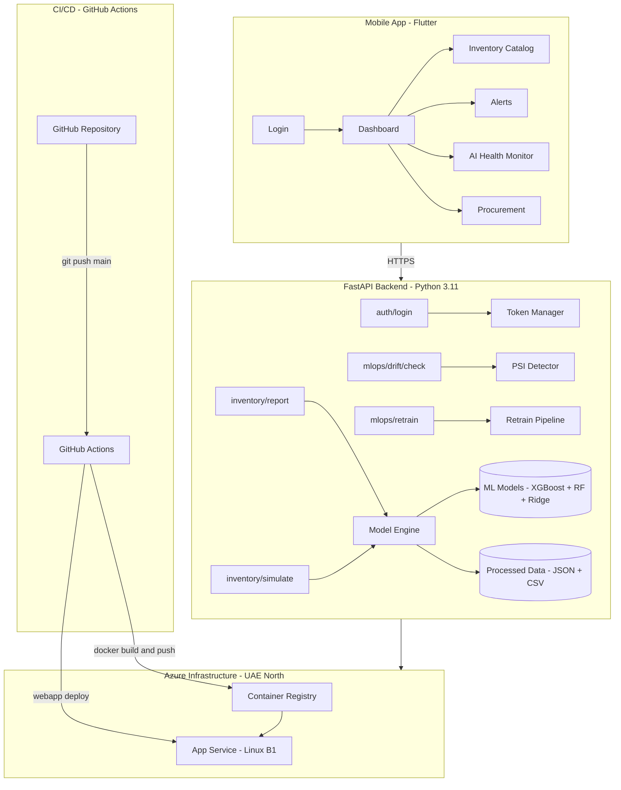

<div align="center">


# StockSense
### AI-Powered FMCG Demand Forecasting & Inventory Optimization Engine

*Prevent stockouts. Eliminate overstocking. Make smarter procurement decisions — in real time.*

---


</div>

---

## 📋 Table of Contents

- [Overview](#-overview)
- [System Architecture](#-system-architecture)
- [Key Features](#-key-features)
- [Technology Stack](#-technology-stack)
- [ML Ensemble Model](#-ml-ensemble-model)
- [API Reference](#-api-reference)
- [Mobile App](#-mobile-app-stocksense)
- [MLOps & Monitoring](#-mlops--monitoring)
- [Project Structure](#-project-structure)
- [Getting Started](#-getting-started)
- [Docker Deployment](#-docker-deployment)
- [Azure Deployment](#-azure-deployment)
- [Authentication](#-authentication)
- [Contributors](#-contributors)
- [Acknowledgements](#-acknowledgements)

---

## 🌟 Overview

**StockSense** is a production-grade, end-to-end AI system developed for the FMCG (Fast-Moving Consumer Goods) sector. It combines a high-precision machine learning ensemble, a real-time FastAPI backend, a Flutter mobile application, and automated MLOps infrastructure to help operations teams make data-driven inventory decisions.

The system covers the full lifecycle:
- **Data Processing** → Feature Engineering → **ML Training** → **API Serving** → **Mobile App** → **Drift Monitoring** → **Auto-Retraining**

---

## 🏛️ System Architecture



---

## ✨ Key Features

| Feature | Description |
|---|---|
| 🤖 **3-Model ML Ensemble** | Weighted combination of XGBoost, Random Forest, and Ridge Regression for superior FMCG demand forecasting |
| 📊 **4-Week Demand Forecast** | Predicts demand at SKU level across a 4-week rolling horizon with confidence intervals |
| 📦 **Inventory Optimization** | Real-time computation of EOQ (Economic Order Quantity), Safety Stock, and Reorder Points |
| ⚠️ **Expiry Monitoring** | Automated batch tracking to flag near-expiry stock and trigger markdown alerts |
| 🔄 **MLOps Drift Detection** | PSI (Population Stability Index) monitoring to detect feature distribution shifts in production |
| 🔁 **Auto-Retraining** | Background retraining pipeline triggered automatically when PSI ≥ 0.25 |
| 📱 **120Hz Mobile UI** | Flutter app with sub-pixel sparkline charts, glassmorphism design, and ultra-smooth animations |
| 🌓 **Dynamic Theming** | Instant Dark/Light mode toggle with persistent state across app restarts |
| 🔐 **Role-Based Access** | Separate Manager and Staff workflows with scoped feature visibility |
| 🐳 **Docker Containerized** | Production-ready `python:3.11-slim` image (~1.5GB) for consistent, reproducible deployments |
| ☁️ **Azure Deployed** | Live on Azure App Service (B1 Linux) in the UAE North (Dubai) region |
| ⚙️ **CI/CD Pipeline** | GitHub Actions auto-builds and deploys on every push to `main` |

---

## 🛠️ Technology Stack

### Backend & ML
| Layer | Technology | Version | Purpose |
|---|---|---|---|
| API Framework | FastAPI | 0.115+ | High-performance async REST API |
| Server | Uvicorn | 0.29+ | ASGI production server |
| ML — Gradient Boosting | XGBoost | 2.0+ | Primary forecasting model |
| ML — Ensemble | Scikit-learn (RF + Ridge) | 1.4+ | Random Forest & Ridge regression |
| Data Processing | Pandas + NumPy | 2.0 / 1.26+ | Feature engineering & data pipelines |
| Serialization | Joblib | 1.3+ | Model artifact loading |
| Data Interchange | PyArrow + OpenPyXL | 15+ / 3.1+ | Parquet & Excel I/O |
| Environment | Python-dotenv | 1.0+ | Secrets management |

### Mobile
| Layer | Technology | Purpose |
|---|---|---|
| Framework | Flutter (Dart) | Cross-platform iOS, Android, Web, Desktop |
| HTTP Client | `http` package | REST API communication |
| State Persistence | `shared_preferences` | Session token & theme storage |
| Charts | `fl_chart` | Sparkline demand charts |
| Icons | `lucide_icons` | Consistent icon set |
| Fonts | `google_fonts` (Sora, DM Sans) | Modern typography |

### Infrastructure & DevOps
| Tool | Purpose |
|---|---|
| Docker | Containerization via `python:3.11-slim` |
| Azure Container Registry | Private Docker image registry |
| Azure App Service (B1 Linux) | Managed container hosting — UAE North |
| GitHub Actions | CI/CD: build → push → deploy on every `git push` |
| Git + GitHub | Version control and collaboration |

---

## 🤖 ML Ensemble Model

Our demand forecasting engine was built through a rigorous multi-milestone benchmarking process.

### Model Selection Journey

> During Milestone 2, we evaluated 5 candidate model families including **Facebook Prophet** and **SARIMA** (via statsmodels). Both classical time-series models were **discarded** in favour of our tree-linear ensemble due to significantly lower WMAPE scores and 10× faster inference speed. Removing Prophet also eliminated heavy C++ compiler dependencies (`cmdstanpy`), reducing Docker build times from >5 minutes to ~15 seconds.

### Final Ensemble Architecture

```
                    ┌─────────────────┐
                    │   Input SKU +   │
                    │  Feature Vector │
                    └────────┬────────┘
                             │
          ┌──────────────────┼──────────────────┐
          ▼                  ▼                  ▼
   ┌─────────────┐   ┌─────────────┐   ┌─────────────┐
   │  XGBoost    │   │   Random    │   │    Ridge     │
   │  Regressor  │   │   Forest    │   │  Regression  │
   │   (45.1%)   │   │   (49.9%)   │   │    (5.0%)    │
   └──────┬──────┘   └──────┬──────┘   └──────┬──────┘
          │                  │                  │
          └──────────────────┼──────────────────┘
                             ▼
                    ┌─────────────────┐
                    │  Weighted Avg   │
                    │  Ensemble Pred  │
                    └─────────────────┘
```

### Feature Engineering Pipeline
- **Temporal features**: week-of-year, month, quarter, year, is_weekend
- **Lag features**: 1-week, 4-week, 8-week demand lags
- **Rolling statistics**: 4-week and 8-week rolling mean & standard deviation
- **Target encoding**: Brand and Item encoders (176 items, 13 brands)
- **Business features**: Price, promotions, in-stock flag, category signals

---

## 📡 API Reference

**Base URL:** `https://stocksense-backend-eui.azurewebsites.net`

### Authentication

| Method | Endpoint | Auth | Description |
|---|---|---|---|
| `POST` | `/auth/login` | ❌ | Obtain Bearer token |
| `POST` | `/auth/logout` | ✅ | Revoke current session token |

**Login Request:**
```json
{
  "email": "manager@stocksense.com",
  "password": "password123"
}
```
**Login Response:**
```json
{
  "token": "abc123...",
  "role": "executive",
  "token_type": "bearer"
}
```

### Inventory & Forecasting

| Method | Endpoint | Auth | Description |
|---|---|---|---|
| `GET` | `/health` | ❌ | System health & model status |
| `GET` | `/products` | ✅ | Full product catalog with stock levels |
| `GET` | `/inventory/report` | ✅ | SKU-level inventory report (EOQ, Safety Stock, ROP) |
| `POST` | `/inventory/simulate` | ✅ | What-if simulation with custom lead time & service level |
| `GET` | `/inventory/alerts` | ✅ | Low-stock and near-expiry alerts |

### MLOps

| Method | Endpoint | Auth | Description |
|---|---|---|---|
| `GET` | `/mlops/drift/check` | ✅ | Run PSI drift detection across all features |
| `POST` | `/mlops/retrain` | ✅ | Trigger background model retraining |

---

## 📱 Mobile App (StockSense)

Located in `stocksense/` — a cross-platform Flutter application.

### Role-Based Navigation

| Screen | Manager (Executive) | Staff (Operator) |
|---|---|---|
| Dashboard | ✅ Full KPI overview | ❌ |
| Inventory Catalog | ✅ Full details + simulation | ✅ Read-only view |
| Alerts | ✅ Full management | ✅ View only |
| Brand Matrix | ✅ | ❌ |
| AI Health Monitor | ✅ | ❌ |
| Barcode Scanner | ❌ | ✅ |

### Running the Mobile App

```bash
cd stocksense
flutter pub get
flutter run
```

---

## 🔄 MLOps & Monitoring

### Drift Detection (`mlops/monitoring/drift_detector.py`)
Uses **Population Stability Index (PSI)** to compare runtime feature distributions against training baseline data:

$$PSI = \sum_{i} \left( P_{actual,i} - P_{expected,i} \right) \cdot \ln\left(\frac{P_{actual,i}}{P_{expected,i}}\right)$$

| PSI Range | Interpretation | Action |
|---|---|---|
| < 0.10 | ✅ Stable | No action needed |
| 0.10 – 0.25 | ⚠️ Minor shift | Monitor closely |
| ≥ 0.25 | 🚨 Significant drift | **Trigger retraining** |

### Retraining Pipeline (`mlops/retraining/retrain_pipeline.py`)
Automatically retrains all three ensemble models on the latest weekly transaction data when drift is detected.

---

## 📁 Project Structure

```
Project-6-Demand-Forecasting-Inventory-Optimization-Engine-/
│
├── 📂 src/                         # Backend source code
│   ├── api/
│   │   ├── main.py                 # FastAPI app, routes & lifespan
│   │   ├── auth.py                 # Bearer token authentication
│   │   ├── model_loader.py         # ML ensemble engine (singleton)
│   │   └── schemas.py              # Pydantic request/response models
│   ├── data/
│   │   └── data_loader.py          # Data ingestion & validation
│   └── features/
│       └── feature_engineer.py     # Feature engineering pipeline
│
├── 📂 src/models/                  # Trained ML artifacts
│   ├── xgb_model.joblib            # XGBoost model (~1.1MB)
│   ├── rf_model.joblib             # Random Forest model (~11.2MB)
│   ├── ridge_model.joblib          # Ridge regression model
│   ├── ridge_scaler.joblib         # StandardScaler for Ridge
│   ├── item_encoder.json           # Target encoder — 176 items
│   ├── brand_encoder.json          # Target encoder — 13 brands
│   ├── feature_cols.json           # 20 feature column definitions
│   ├── ensemble_weights.json       # Model blend weights
│   └── model_metrics.json          # Validation metrics snapshot
│
├── 📂 data/processed/              # Runtime data files
│   ├── current_stock.json          # Live inventory snapshot
│   ├── expiry_batches.json         # Batch expiry tracking
│   ├── ml_forecasts.csv            # 4-week demand forecasts (136 SKUs)
│   └── inventory_report.csv        # Full inventory report
│
├── 📂 mlops/                       # MLOps infrastructure
│   ├── monitoring/drift_detector.py
│   └── retraining/retrain_pipeline.py
│
├── 📂 notebooks/                   # Jupyter analysis notebooks
│   ├── 01_data_exploration.ipynb
│   ├── 02_model_development.ipynb
│   ├── 03_inventory_optimization.ipynb
│   ├── 04_mlops_pipeline.ipynb
│   └── weekly.csv                  # Weekly training data (3,321 rows)
│
├── 📂 stocksense/                  # Flutter mobile application
│   ├── lib/
│   │   ├── main.dart
│   │   ├── screens/                # 9 feature screens
│   │   ├── services/api_service.dart
│   │   ├── models/
│   │   └── theme/app_theme.dart
│   └── pubspec.yaml
│
├── 📂 static/                      # Web dashboard mockup
│   └── index.html
│
├── 📂 docs/                        # Project documentation
│   └── PROJECT_MEMORY.md           # Architecture memory bank
│
├── 📂 .github/workflows/
│   └── deploy.yml                  # GitHub Actions CI/CD pipeline
│
├── Dockerfile                      # Production container build
├── .dockerignore                   # Docker context exclusions
├── requirements-prod.txt           # Runtime dependencies only
└── requirements.txt                # Full dev + training dependencies
```

---

## 🚀 Getting Started

### Prerequisites
- Python 3.10+
- Flutter 3.x SDK
- Docker Desktop
- Azure CLI (for deployment)

### Option A — Local Development

**1. Start the FastAPI Backend:**
```bash
# Install full development dependencies
pip install -r requirements.txt

# Start the API server
scripts\start_backend.bat
# or directly:
uvicorn src.api.main:app --host 0.0.0.0 --port 8000 --reload
```
Visit `http://localhost:8000/docs` for the interactive Swagger UI.

**2. Launch the Flutter Mobile App:**
```bash
cd stocksense
flutter pub get
flutter run
```

---

## 🐳 Docker Deployment

**Build the production image (slim, no dev dependencies):**
```bash
docker build -t stocksense-api .
```

**Run locally:**
```bash
docker run -d -p 8000:8000 --name stocksense-server stocksense-api
```

**Verify:**
```bash
curl http://localhost:8000/health
# → {"status":"ok","models_loaded":true,"products_count":203,"version":"1.0.0"}
```

---

## ☁️ Azure Deployment

The backend is deployed on **Azure App Service (Linux B1)** in the **UAE North (Dubai)** region.

| Azure Resource | Name | Region |
|---|---|---|
| Resource Group | `stocksense-rg` | UAE North |
| Container Registry | `stocksensecr.azurecr.io` | UAE North |
| App Service Plan | `stocksense-plan` (B1 Linux) | UAE North |
| Web App | `stocksense-backend-eui` | UAE North |

**Live endpoint:**
```
https://stocksense-backend-eui.azurewebsites.net
```

### CI/CD Pipeline
Every push to `main` automatically:
1. Builds the Docker image on GitHub Actions
2. Pushes it to Azure Container Registry
3. Deploys to Azure App Service via rolling restart

---

## 🔐 Authentication

| Role | Email | Password | Access Level |
|---|---|---|---|
| **Manager** | `manager@stocksense.com` | `password123` | Full access — Dashboard, Simulation, AI Health, Procurement, MLOps |
| **Staff** | `staff@stocksense.com` | `password123` | Operational — Catalog, Alerts, Barcode Scanner |

> **Note:** Legacy credentials (`executive@crunchops.com` and `operator@crunchops.com`) remain supported for backward compatibility.

---

## 👥 Contributors

<div align="center">

| Name | Role |
|---|---|
| **Ahmed Arafa** | Project Lead & ML Engineer |
| **Mark Mohsen** | Backend Developer & API Design |
| **Sama Ashraf** | Data Scientist & Feature Engineering |
| **Hadeer Mahmoud** | Mobile App Developer (Flutter) |
| **Eman Ahmed** | MLOps & Deployment Engineer |

</div>

---

## 🙏 Acknowledgements

<div align="center">

We extend our deepest gratitude to our incredible instructor for his unwavering guidance, technical mentorship, and support throughout every milestone of this project:

### 🌟 Eng. Abdelrahman Elmashtoly
*The amazing instructor who made this possible.*

---

This project was developed as part of the **AI & Data Science - Microsoft Machine Learning Engineer (DEPI)** program.

<br/>

*Built with ❤️ by the StockSense Team*

</div>
