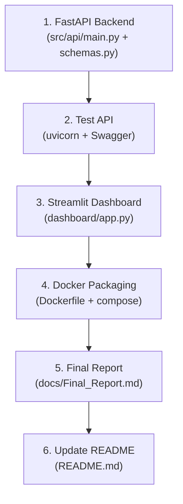

# 🚀 Implementation Plan — Remaining Milestones

> **Purpose:** This document is a full handoff guide for a co-worker to continue development.  
> **Status as of July 3, 2026:** Milestones 1–4 are **DONE**. This plan covers Milestones 5–7.

---

## ✅ What's Already Done (Do NOT Redo)

| Milestone | Notebook / Location | Status |
|-----------|-------------------|--------|
| **M1: Data Collection & EDA** | `notebooks/00_data_prepairing.ipynb`, `notebooks/01_data_collection_eda.ipynb` | ✅ Complete |
| **M2: Model Development** | `notebooks/02_model_development.ipynb` | ✅ Complete |
| **M3: Inventory Optimization** | `notebooks/03_inventory_optimization_mlops.ipynb` (Sections 1–5) | ✅ Complete |
| **M4: MLOps Monitoring** | `notebooks/03_inventory_optimization_mlops.ipynb` (Sections 6–9) | ✅ Complete |

### Key Artifacts Available

| Artifact | Path | Description |
|----------|------|-------------|
| **XGBoost model** | `src/models/xgb_model.joblib` (~1 MB) | Best single model — WMAPE=34.5%, R²=0.84 |
| **Random Forest model** | `src/models/rf_model.joblib` (~11 MB) | Second model in ensemble |
| **Ridge model** | `src/models/ridge_model.joblib` | Included but excluded from final ensemble (poor perf) |
| **Ridge scaler** | `src/models/ridge_scaler.joblib` | StandardScaler for Ridge |
| **Ensemble weights** | `src/models/ensemble_weights.json` | `{"XGBoost": 0.493, "Random Forest": 0.507}` |
| **Feature columns** | `src/models/feature_cols.json` | 20 feature names the models expect |
| **Item encoder** | `src/models/item_encoder.json` | ItemID → log-mean-Qty target encoding |
| **Brand encoder** | `src/models/brand_encoder.json` | BrandID → log-mean-Qty target encoding |
| **Brand avg week** | `src/models/brand_avg_week.json` | BrandID → avg weekly log-Qty |
| **Global mean** | `src/models/global_mean_qty.json` | `{"global_mean_qty": 5.016}` (fallback for unseen IDs) |
| **ML Forecasts** | `data/processed/ml_forecasts.csv` | 136 SKUs × 9 columns |
| **Inventory Report** | `data/processed/inventory_report.csv` | 136 SKUs × 7 columns (EOQ, SS, ROP) |
| **Raw data** | `notebooks/weekly.csv` | 3,321 rows × 20 columns |

### How the Model Works (Critical for API Development)

The model predicts demand in **log space** and converts back:

```python
# Prediction pipeline
log_prediction = xgb_model.predict(features)       # predict in log1p space
real_prediction = np.clip(np.expm1(log_prediction), 0, None)  # convert back
ensemble = w_xgb * real_xgb + w_rf * real_rf        # weighted ensemble
```

The 20 features expected (in order):
```
lag_1, lag_2, lag_4, rolling_mean_4, rolling_std_4, rolling_mean_4_raw,
Avg_UnitPrice, log_price, price_change_pct, Total_Promo, has_promo,
Week, Month, week_sin, week_cos, Factor, UOM_encoded,
item_encoded, brand_encoded, brand_avg_week_qty
```

> [!IMPORTANT]
> `item_encoded`, `brand_encoded`, `brand_avg_week_qty` are **target encodings** computed from training data. Use the JSON encoder files to map IDs. For **unseen** ItemIDs/BrandIDs, use the `global_mean_qty` value (5.016) as fallback.

---

## Milestone 5: FastAPI Backend

### Goal
Create a REST API that loads the trained models once at startup and serves predictions + inventory metrics on demand.

---

### [NEW] `src/api/main.py`

The core API server. Implements these endpoints:

| Endpoint | Method | Description | Response |
|----------|--------|-------------|----------|
| `/health` | GET | Health check | `{"status": "healthy"}` |
| `/api/v1/skus` | GET | List all known SKUs | `[{"ItemID": "...", "ItemName": "..."}]` |
| `/api/v1/forecast/{item_id}` | GET | Get forecast for a specific SKU | See schema below |
| `/api/v1/inventory/{item_id}` | GET | Get inventory metrics (EOQ, SS, ROP) | See schema below |
| `/api/v1/inventory/alerts` | GET | All SKUs below their reorder point | List of alerts |
| `/api/v1/forecast/batch` | POST | Forecast for multiple SKUs | Array of forecasts |

#### Forecast Response Schema
```json
{
  "ItemID": "BCH-3-08-00272",
  "ItemName": "بوشارتي ملح",
  "forecast_weekly_qty": 3192.6,
  "forecast_std": 847.5,
  "avg_daily_demand": 456.1,
  "model": "XGB+RF Ensemble",
  "model_wmape": 34.5,
  "model_r2": 0.84
}
```

#### Inventory Response Schema
```json
{
  "ItemID": "BCH-3-08-00272",
  "ItemName": "بوشارتي ملح",
  "EOQ": 1200,
  "safety_stock": 1398.3,
  "reorder_point": 4590.9,
  "orders_per_year": 15.2,
  "service_level": "95%"
}
```

#### Implementation Details

```python
from fastapi import FastAPI, HTTPException
from fastapi.middleware.cors import CORSMiddleware
import joblib, json, pandas as pd, numpy as np
from pathlib import Path

app = FastAPI(title="Demand Forecasting API", version="1.0.0")

# Enable CORS for mobile/web clients
app.add_middleware(CORSMiddleware, allow_origins=["*"], allow_methods=["*"], allow_headers=["*"])

# Load models ONCE at startup
MODEL_DIR = Path("src/models")
xgb_model = joblib.load(MODEL_DIR / "xgb_model.joblib")
rf_model = joblib.load(MODEL_DIR / "rf_model.joblib")
# ... load all JSON encoders ...

# Load pre-computed forecasts and inventory
df_forecast = pd.read_csv("data/processed/ml_forecasts.csv")
df_inventory = pd.read_csv("data/processed/inventory_report.csv")
```

> [!TIP]
> For the MVP, the API can simply **look up pre-computed values** from the CSV files rather than running the model live. This is simpler, faster, and perfectly valid for the demo. Live prediction is only needed if the user uploads new weekly data.

---

### [NEW] `src/api/schemas.py`

Pydantic models for request/response validation:

```python
from pydantic import BaseModel
from typing import Optional

class ForecastResponse(BaseModel):
    ItemID: str
    ItemName: str
    forecast_weekly_qty: float
    forecast_std: float
    avg_daily_demand: float

class InventoryResponse(BaseModel):
    ItemID: str
    ItemName: str
    EOQ: float
    safety_stock: float
    reorder_point: float
    orders_per_year: float
```

---

### How to Run

```bash
cd Project-6-Demand-Forecasting-Inventory-Optimization-Engine-
uvicorn src.api.main:app --reload --host 0.0.0.0 --port 8000
```

Then visit `http://localhost:8000/docs` for the auto-generated Swagger UI.

---

## Milestone 6: Streamlit Dashboard

### Goal
An interactive web dashboard that consumes the FastAPI backend (or reads CSVs directly) and visualizes forecasts + inventory.

---

### [NEW] `dashboard/app.py`

| Page / Section | Content |
|----------------|---------|
| **Sidebar** | SKU selector dropdown, service level slider (90/95/99%) |
| **Page 1: Forecast Overview** | Bar chart of top 20 SKUs by forecasted demand, KPI cards (total demand, # SKUs, avg WMAPE) |
| **Page 2: SKU Detail** | Time series plot (historical + forecast), model metrics table |
| **Page 3: Inventory Dashboard** | Table of all SKUs with EOQ, SS, ROP; color-coded alerts for items below ROP |
| **Page 4: MLOps Health** | PSI drift chart, WMAPE over time, retraining recommendation |

#### Key Implementation Notes

- Use `st.set_page_config(layout="wide")` for a professional layout
- Load data from the CSVs directly (simpler for demo) OR call the FastAPI endpoints
- Use `plotly` instead of `matplotlib` for interactive charts (add `plotly` to requirements.txt)

### How to Run

```bash
cd Project-6-Demand-Forecasting-Inventory-Optimization-Engine-
streamlit run dashboard/app.py
```

---

## Milestone 7: Deployment & Final Report

### [NEW] `Dockerfile`

```dockerfile
FROM python:3.11-slim
WORKDIR /app
COPY requirements.txt .
RUN pip install --no-cache-dir -r requirements.txt
COPY . .
EXPOSE 8000
CMD ["uvicorn", "src.api.main:app", "--host", "0.0.0.0", "--port", "8000"]
```

### [NEW] `docker-compose.yml` (Optional)

Run both API + Dashboard together:

```yaml
version: "3.8"
services:
  api:
    build: .
    ports: ["8000:8000"]
  dashboard:
    build: .
    command: streamlit run dashboard/app.py --server.port 8501
    ports: ["8501:8501"]
    depends_on: [api]
```

### [NEW] `docs/Final_Report.md`

Consolidate everything into a final report:

1. **Problem Statement** — Demand forecasting for 136 FMCG SKUs
2. **Data Overview** — 3,321 rows, 26 weeks, from `weekly.csv`
3. **Methodology** — Global XGBoost+RF ensemble with log-transform
4. **Results** — WMAPE=34.5%, R²=0.84 (XGBoost standalone)
5. **Inventory Optimization** — EOQ, Safety Stock, ROP formulas and results
6. **MLOps** — PSI drift monitoring, automated retraining logic
7. **API & Dashboard** — Screenshots of Swagger UI and Streamlit
8. **Lessons Learned** — Log-transform fix, Ridge exclusion, data limitations

---

## Updated `requirements.txt`

Add these new dependencies:

```diff
 # ── ML APIs ───────────────────────────────────────────────────────────────────
 fastapi>=0.110
 uvicorn>=0.29
+pydantic>=2.0

 # ── Dashboard ─────────────────────────────────────────────────────────────────
 streamlit>=1.33
+plotly>=5.18
```

---

## File Change Summary

| Action | File | Description |
|--------|------|-------------|
| **[NEW]** | `src/api/main.py` | FastAPI server with 6 endpoints |
| **[NEW]** | `src/api/schemas.py` | Pydantic request/response models |
| **[NEW]** | `dashboard/app.py` | 4-page Streamlit dashboard |
| **[NEW]** | `Dockerfile` | Container for API deployment |
| **[NEW]** | `docker-compose.yml` | Multi-service orchestration |
| **[NEW]** | `docs/Final_Report.md` | Project summary and results |
| **[MODIFY]** | `requirements.txt` | Add `pydantic`, `plotly` |
| **[MODIFY]** | `README.md` | Update milestone status, add run instructions |

---

## Execution Order

> [!IMPORTANT]
> Follow this order strictly. Each step depends on the previous one.



### Estimated Time

| Step | Estimated Effort |
|------|-----------------|
| FastAPI Backend | 2–3 hours |
| Streamlit Dashboard | 3–4 hours |
| Docker Packaging | 1 hour |
| Final Report | 1–2 hours |
| **Total** | **~8–10 hours** |

---

## Quick Start for the Co-Worker

```bash
# 1. Clone and setup
git clone <repo-url>
cd Project-6-Demand-Forecasting-Inventory-Optimization-Engine-
python -m venv venv
venv\Scripts\activate        # Windows
pip install -r requirements.txt

# 2. Verify notebooks run (optional — they're already executed)
jupyter notebook notebooks/

# 3. Build the API
# Create src/api/main.py and src/api/schemas.py as described above
uvicorn src.api.main:app --reload
# Visit http://localhost:8000/docs

# 4. Build the Dashboard
# Create dashboard/app.py as described above
streamlit run dashboard/app.py

# 5. Dockerize
docker build -t demand-forecast-api .
docker run -p 8000:8000 demand-forecast-api
```
